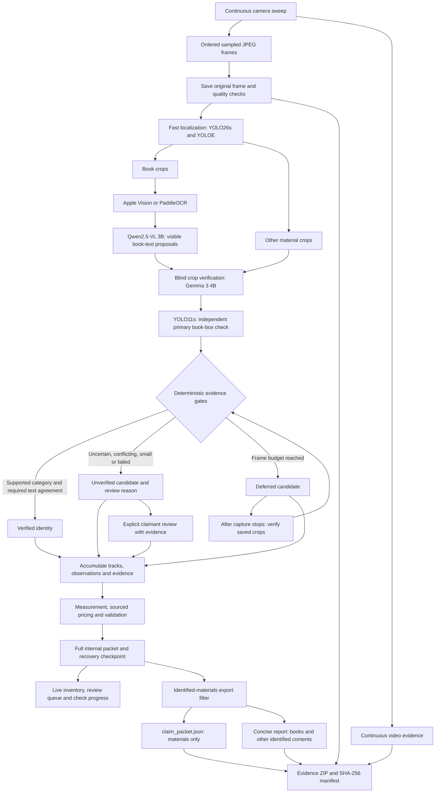
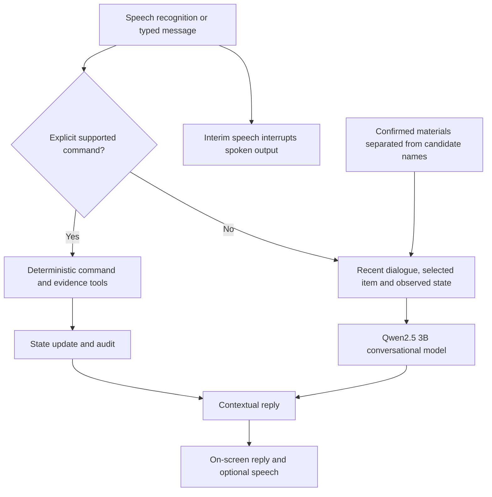

# Architecture — Library Contents Claim Agent

The application separates fast localization, visual verification, evidence rules, conversation and exports. A detector label starts a candidate; it does not establish an identified material.

## Inventory and report flow

### Identity and export rules

- **Books:** automatic identity requires a complete crop, verified book category, high-confidence exact OCR/image-title agreement and independent count agreement. Author/publisher must occur in crop OCR; visible ISBNs require valid checksums. Missing metadata remains blank.
- **Other materials:** the blind verifier must return a clear category matching the detector, with distinguishing visible parts where required. It receives the crop without the detector label. Conflicting names cannot silently replace detector proposals.
- **Review:** small crops, unknown categories, malformed or truncated replies, timeouts and conflicts remain unverified. Recorded claimant review can establish identity; later inference preserves reviewed facts.
- **Exports:** `materials.py` excludes detector-only guesses, unverified book titles, structural classes and uncertain/conflicting names. HTML and downloadable JSON use this same filter. Internal packets retain candidates for audit and review.

Live verification has a 90-second aggregate frame budget and a 45-second request timeout. Deferred crops are checked in the background after capture stops. The UI shows completion progress; exports refresh when the worker finishes. Saved-sweep verification checks every retained candidate without rerunning localization.

## Conversational flow

The conversation model can explain results and respond naturally, but cannot mutate claim facts, invent measurements or set prices. Explicit tools perform supported actions. Conversation uses recent history and observed inventory, with a 15-second request timeout and an honest failure fallback. Stale replies are suppressed and capture announcements yield to dialogue.

## Model comparison before switching

Four installed models were compared on six identical saved crops before enabling the separate Gemma 3 4B verifier. Qwen3-VL 8B timed out on all six. The 4B verifier still made wrong guesses; category agreement and visible-parts rules rejected those diagnostic false names. The parts rule was developed during the comparison, so these are targeted development regressions, not independent accuracy certification. See [model validation](model-validation.md) and `data/diagnostics/crop-verification/comparison.json`.

## Component responsibilities

| Component | Responsibility |
| --- | --- |
| `frontend/src/App.tsx`, `recording.ts` | Camera, ordered frame queue, voice interaction, live review and video evidence |
| `main.py` | FastAPI transport, checkpoints, SSE, exports and deferred verification worker |
| `local_detector.py`, `room_detector.py` | Fast localization, crop OCR, visible-text proposals and count comparison |
| `crop_verifier.py` | Blind crop checks, response validation, visible-parts rules, cache and inference limits |
| `identification.py`, `tracking.py`, `agent.py` | Identity gates, accumulated observations, reviewed-fact preservation and workflow orchestration |
| `dialogue.py`, `conversation.py` | Contextual dialogue and explicit command routing |
| `measurement.py` | Calibrated spine measurements and recorded room geometry |
| `research.py`, `pricing.py`, `validation.py` | Optional source retrieval, verified offers, appraisal rules and review findings |
| `materials.py`, `packet.py`, `bundle.py` | Identified-only materials, concise HTML, code totals and evidence delivery |
| `pipeline.py`, `performance.py`, `logging_utils.py` | Stage timings, audit events and observed performance |
| `backend/tools/compare_crop_models.py`, `verify_saved_sweep.py` | Model comparison and saved-evidence verification |

## Measurement, valuation and persistence

Models do not generate metric scale or claim totals. Spine dimensions require operator-marked spine bounds and a known reference in the same frame and image plane. Whole-book boxes cannot supply spine thickness. Room area uses recorded dimensions or supplied calibrated geometry; tilt and depth differences require review.

Optional catalogue lookup resolves a work without proving an edition. Price comparables require reviewed sources, retrieval dates, condition, identity match and currency. Foreign currency requires dated FX evidence. Appraisal rules exclude special/high-value books and original art from automatic valuation. Code computes known-value subtotals; missing prices remain excluded.

Full recovery state lives in `data/packets/<sweep-id>.json` and its `.active.json` checkpoint. User-facing JSON and HTML live in `data/claims/<sweep-id>/`. Original frames, failed observations and video remain auditable. SSE sends inventory and verification progress; checkpoints preserve work across development reloads. Empty frames do not erase earlier detections. Cross-view association can still miss or duplicate objects.

Model agreement can still be wrong. Local latency, first-load costs and the 8 GB memory limit remain constraints. Unit tests and small crop comparisons do not certify whole-room accuracy or the assignment's time target. Ground-truth evaluation and the unedited demo remain separate validation steps.
