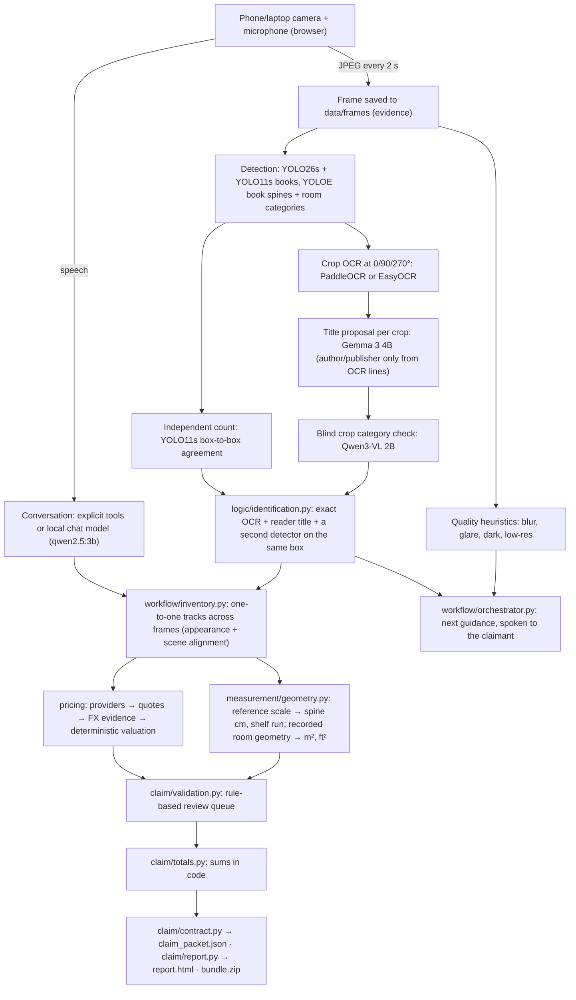

# Architecture note

One continuous sweep, separate testable stages, no invented numbers.

## Which model does what

| Stage | Component | Role | Can it write a fact? |
| --- | --- | --- | --- |
| Capture quality | `logic/perception.py` | Pillow heuristics for blur, glare, darkness, resolution → spoken guidance | no (review notes) |
| Book / object boxes | YOLO26s + YOLO11s (`perception.detect_objects`) and YOLOE "book" boxes | localizes books and COCO objects; every detector that drew a box is recorded in `seen_by` | boxes only |
| Room categories | YOLOE26s with fused prompts (classes in `config.py`) | shelving, lamp, framed painting, rug, coffee machine, … | category *proposal* |
| Second count | YOLO11s (`validate_boxes`) | per book: another detector drew the same box (IoU >= 0.5) → `count_verified`; frame-wide count equality is only a review note | agreement flag |
| Spine text | PaddleOCR / EasyOCR (`logic/ocr.py`) | text lines + confidence per crop, best of three rotations | OCR evidence |
| Title proposal | Gemma 3 4B via Ollama (`read_visual_title`) | reads the visible title; author/publisher constrained to OCR lines | proposal only |
| Crop check | Qwen3-VL 2B via Ollama (`logic/crop_verifier.py`) | blind category check of the crop without the detector label | agree / conflict |
| Identity | `logic/identification.py` (pure rules) | accepts a title only when OCR text (≥0.9), reader title, blind crop check and the per-book second-detector witness agree | **yes** (status identified) |
| Catalogue | Open Library (`logic/identification.py`) | resolves a work; edition only from a checksum-valid visible ISBN | work / edition metadata |
| Conversation | qwen2.5:3b via Ollama (`logic/conversation.py`) | answers questions with the live state; explicit commands bypass it | no |

## Metric scale

* **Spines:** the claimant states a known shelf width during the sweep ("the shelf is 90
  centimetres wide"); the detected shelf/book-row span in that frame gives cm per pixel, and
  the front-on book boxes become spine height × thickness. An explicit reference line can
  also be posted to `/calibration`. Method and calibration are stored on each book.
* **Room:** recorded dimensions (tape, plan or LiDAR export) against a sweep frame; rectangle
  or floor-plan polygon (shoelace area, perimeter × height for gross walls, shelving
  rectangles for shelved wall area). `room.scale_method`, `source`, `frame_ref`,
  `confidence` and assumptions are stored. No separate measuring pass.

## Where prices come from

`logic/providers.py` holds the three retrieval paths: eBay Browse (fixed-price listings; new →
replacement, used → used value; median of matching listings; comparables kept), Google Books
(country list prices; ebooks flagged) and FX (dated ECB/ER-API rates for
`converted: true`). `logic/pricing.py` applies the rules without network or models and
records every candidate and rejection in `price_details`. Operator-checked offers entered in
the review panel carry the same evidence fields. Appraisal rules: signed/rare/antiquarian/
first editions, original art (unless the claimant says "print"), and anything at or above the
configurable threshold.

## Validation, review queue and totals

`logic/claim.py` rebuilds workflow findings on every change: unreadable spine,
confidence below threshold, no accepted price (with the provider rejection reasons), missing
source URL/date, currency mismatch, converted price without FX evidence, implausible
dimensions, duplicate IDs, missing evidence frame, unknown room scale, unconfirmed coverage.
Perception notes (count disagreement, OCR unavailable) and claimant statements are kept.
`logic/claim.py` (totals) sums only known values; `excluded_from_totals` counts the blanks.

## Latency and cost

Each stage records elapsed seconds (`pipeline_stages` per frame, `stage_runs` per workflow
pass); `GET /api/sweeps/{id}/performance` summarises calls, mean and max per stage, and
`time_to_packet_s` is measured from stop-capture to finish. Model API cost is zero (local
inference); provider calls (eBay, Google Books, FX) are counted in `cost.provider_calls`
and are free-tier.
