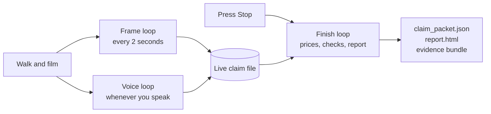
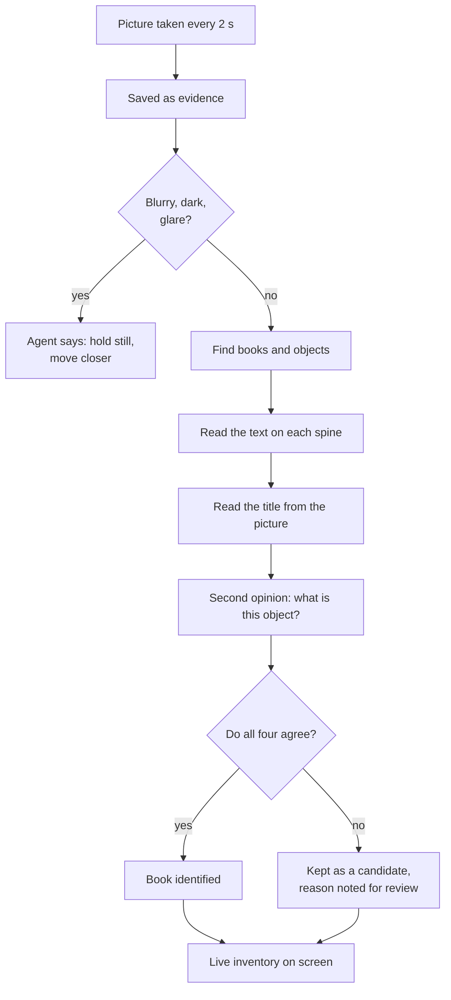
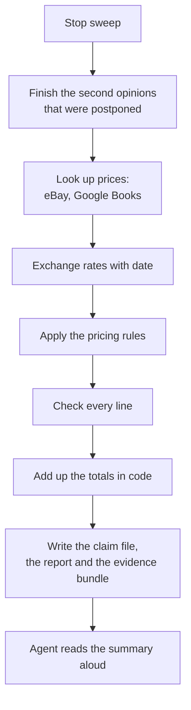

# How it works (plain-language guide)

This document explains what the Library Contents Claim Agent does, step by step, without
code. It is written for an adjuster, a product owner or anyone who wants to understand the
flow before reading the technical guide (`docs/technical-guide.md`).

## The problem it solves

After a fire, flood or burglary, a policyholder has to list every book and object in a room,
say what each one is worth, and prove it. Today that means a spreadsheet, photos, and a site
visit. This agent turns that into **one walk around the room with a phone**, talking to an
assistant while the inventory writes itself. The output is a claim file an adjuster can
check line by line.

## The one rule behind everything

**Software may propose; only evidence may decide.**

- A camera model may say "that looks like a book". It cannot decide the book exists.
- A text model may say "the title seems to be Dune". It cannot decide the title.
- A price only exists when it comes from a real listing with a link and a date.
- Every total is added up in ordinary code, never by an AI.

If any step is unsure, the line is left blank and put in a review list with the reason. A
blank is always preferred over a guess, because a guess cannot be defended in a dispute.

## The three loops

The whole program is three loops working on one shared claim file. Two run while the camera
is on; the third runs once when you stop.

## Step by step: starting a sweep

1. Open the page, pick the **country**. The currency follows automatically. This matters
   because the same book has a different replacement price in London and in Dubai.
2. Set the **appraisal threshold** (default 2,000 in the claim currency). Anything worth more
   than this is never priced automatically; it is sent to a human appraiser.
3. Press **Start sweep**. The browser asks for the camera and microphone. The agent greets
   you, confirms the country and currency, and explains what to do in two sentences.

## Step by step: the frame loop (what happens to every picture)

1. **Picture saved.** Every frame is stored on disk with a name. Every line in the final
   claim points back to the frame it came from, so an adjuster can look at the actual photo.
2. **Quality check.** Blur, darkness and glare are measured. If the picture is bad, the agent
   tells you how to fix it instead of trying to read it.
3. **Find the books and objects.** Three detectors draw boxes: two general ones and one that
   is told the vocabulary of a home library (shelving, lamp, framed painting, rug, book spine).
   Everything that is not a book (television, chairs, vases, a lamp) becomes an "item".
4. **Read the spine text.** The text on each book is read by OCR, trying the crop upright and
   rotated both ways, because spines are printed in all directions.
5. **Read the title from the picture.** A small vision model looks at the same crop and says
   what the main title is. It may only copy an author or publisher that the OCR also saw.
6. **Second opinion.** A different vision model is shown the crop with no hint and asked
   "what is this?" If it does not say "book", the line cannot be identified.
7. **Agreement.** A book is marked **identified** only when the OCR text, the picture reading,
   the second opinion and a second detector all agree on the same box. Otherwise it stays a
   **candidate** with the reasons listed.
8. **Live inventory.** The screen updates after every frame: how many books seen, how many
   identified, how many need review.

## Step by step: the voice loop (talking to the agent)

The agent listens the whole time. There are two kinds of sentences.

**Commands** change the claim and are matched exactly, so a stray word cannot trigger them:

| You say | What happens |
| --- | --- |
| "next shelf" | the next frames are labelled as the next shelf |
| "skip this shelf, those are not mine" | that shelf's books are removed from the claim but kept in the evidence history |
| "that is a first edition" / "signed copy" | the selected book is flagged for human appraisal |
| "it is a print" / "it is an original" | answers the agent's question about a picture on the wall |
| "the shelf is 90 centimetres wide" | gives the real-world scale, so book heights and thicknesses are measured in cm |
| "the room is 4.2 by 3.1 metres, ceiling 2.6" | records the room size; floor and wall areas are calculated |
| "compare prices in the United Kingdom" | re-prices ten books for a second country |
| "all shelves captured" | records that you confirm the room is fully covered |

**Questions** ("how many books so far?", "what should I do next?") are answered by a small
local chat model that can see the live inventory. It can describe the claim but it is not
allowed to change it.

If you talk while the agent is speaking, the agent stops; the conversation is two-way.

## Step by step: finishing (what happens when you press Stop)

1. **Postponed checks.** During the sweep each frame gets 90 seconds for second opinions; the
   rest are done now.
2. **Price lookup.** For every identified book the agent searches eBay (new listings give the
   replacement cost, used listings give the used value) and Google Books (list prices for the
   claim country). Each candidate keeps its link, date, condition and currency.
3. **Exchange rates.** If a price is in another currency, a dated central-bank rate converts
   it and the line is marked "converted" with the rate and its source.
4. **Pricing rules.** A price typed by an operator beats a local listing, which beats a
   converted foreign one. Weak matches and e-books are rejected with a reason. Signed, rare and
   first editions, original art and anything above the threshold go to appraisal.
5. **Checks.** Every line is tested: is the title readable, is there a price with a source and
   a date, does the currency match, is the measurement plausible, is the evidence frame on
   disk. Failures go to the review list.
6. **Totals.** Added in code from the lines that have values. Lines without a value are counted
   as "excluded from totals" so nobody mistakes a blank for a zero.
7. **Deliverables.** `claim_packet.json` in the agreed structure, `report.html` for reading, and
   a zip with both plus every referenced photo and a checksum list.
8. **Summary.** The agent reads back the counts and totals, generated from the numbers.

## What the adjuster receives

| File | Purpose |
| --- | --- |
| `claim_packet.json` | the structured claim: sweep, room, books, items, totals, review queue, then the evidence behind each decision |
| `report.html` | the same content as a readable report with photo links and the price comparison table |
| `bundle.zip` | packet, report, all referenced frames and a SHA-256 manifest to prove nothing changed |

## What it costs and how long it takes

- **Model cost: zero.** All AI runs on the laptop. The only outside calls are free price and
  exchange-rate lookups, and their count is recorded in the packet.
- **Time:** an empty view takes about 3 seconds. A shelf with ten readable books takes about
  three minutes on an 8 GB laptop, because each book needs two model reads. The time from
  Stop to a finished packet is measured and stored with every sweep.

## Honest limits

- Without eBay credentials, most books will have no price. The packet says so rather than
  inventing one. Google Books without an API key runs into a shared daily quota.
- Dense shelves of very small spines are detected but rarely identified; the agent asks you
  to move closer.
- Measurements need you to state one real dimension; nothing is measured from pixels alone.
- The 60-book ground-truth test, the demo video and the measured results sheet still have to
  be recorded in a real room.
