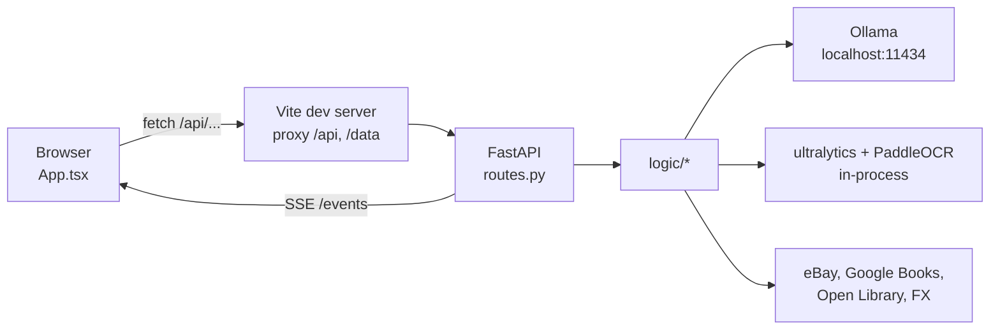
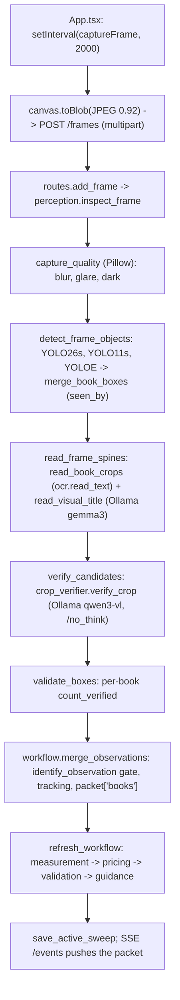
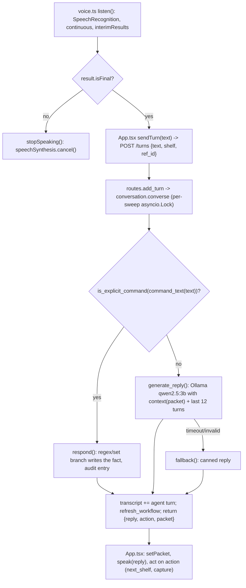
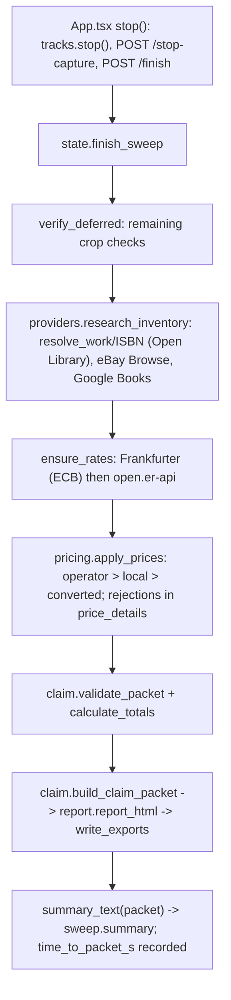

# Technical guide (step by step, with the objects and libraries involved)

Companion to `docs/how-it-works.md`. This document follows the same flow but names the files,
functions, objects and libraries at each step. Line numbers are approximate; function names
are exact.

## Stack

| Layer | Library | Why |
| --- | --- | --- |
| Web UI | React 19, Vite 6, TypeScript 5.7 | one page, hot reload, typed packet |
| Speech | browser `SpeechRecognition`, `speechSynthesis` | no audio leaves the browser; no key needed |
| API | FastAPI, uvicorn, pydantic 2 | validated request bodies, Server-Sent Events |
| HTTP client | httpx (async) | Ollama, eBay, Google Books, Open Library, FX |
| Images | Pillow | crops, rotations, JPEG encoding, quality heuristics |
| Detection | ultralytics (YOLO26s, YOLO11s, YOLOE-26s) on CPU | book and object boxes |
| OCR | PaddleOCR (PP-OCRv6), EasyOCR as alternative | spine text |
| Vision and chat models | Ollama: `gemma3:latest`, `qwen3-vl:2b`, `qwen2.5:3b` | title proposal, blind crop check, conversation |
| Config | python-dotenv | `.env` first, `config.py` defaults as fallback |
| Formatting | Ruff | import order and formatting (`ruff check app tools`) |

## Repository map

```
backend/app/config.py        paths, model names, room classes, API endpoints, Settings (env first)
backend/app/main.py          FastAPI app, CORS, request logging, health, startup warm-up, static mounts
backend/app/routes.py        every HTTP route (transport only)
backend/app/logic/
  state.py                   SWEEPS store, checkpoints, start/finish, background research
  perception.py              quality, detection, OCR per crop, title proposal, count check, inspect_frame
  ocr.py                     PaddleOCR / EasyOCR behind read_text()
  crop_verifier.py           blind category check via Ollama
  identification.py          identity gate rules, Open Library lookups
  tracking.py                appearance signatures, cross-frame matching
  workflow.py                merge_observations, refresh_workflow (measurement -> pricing -> validation), guidance
  conversation.py            Turn model, command matching, voice tools, chat model call
  measurement.py             reference-line and shelf-width scale, room geometry
  pricing.py                 Quote/Offer models, matching, locale table, apply_prices
  providers.py               eBay, Google Books, FX, research, second-country comparison
  claim.py                   SweepStart, empty_packet, totals, validate_packet, build_claim_packet
  report.py                  report_html, claim_bundle
  evaluation.py              scoring against ground truth
  utils.py                   event(), trace_step, pipeline_stage, performance_summary
frontend/src/
  App.tsx                    the page: start/stop, capture loop, SSE, voice wiring
  api.ts                     get/post helpers, API base URL
  voice.ts                   speak(), listen(), barge-in
  types.ts                   Packet, Book, Item, Locale types
  components/Inventory.tsx   counts and line list
  components/Conversation.tsx transcript and text fallback
```

## The central object: `packet`

One Python `dict` per sweep, created by `empty_packet()` in `claim.py`, stored as
`SWEEPS[sweep_id]["packet"]` in `state.py`. Every stage mutates it in place. The first six keys
are the output contract (`sweep`, `room`, `books`, `items`, `totals`, `review_queue`); the rest
is working state (`frames`, `transcript`, `calibrations`, `guidance`, `price_details`,
`research`, `quotes`, `fx_rates`, `audit_trail`, `stage_runs`, `performance`, ...).

It is checkpointed to `data/packets/<id>.active.json` after every change, streamed to the
browser over SSE, and finally filtered by `build_claim_packet()` into `claim_packet.json`.

## Request flow



In development the browser only talks to Vite; `vite.config.ts` forwards `/api` and `/data`
to `127.0.0.1:8000`, so no CORS is needed. In a production build FastAPI serves
`frontend/dist` itself.

## Step 1: configuration (`config.py`)

- `load_dotenv(BACKEND_DIR / ".env")` then `model_choices.env`. Shell and `.env` values win.
- Module constants `DEFAULT_*` are the fallbacks; `Settings` properties read `os.getenv(name,
  DEFAULT)` lazily, so a value is resolved on first use.
- `ROOM_CLASSES` is the prompt list fused into the YOLOE weights by `tools/setup_detector.py`.
- Endpoint constants (`GOOGLE_BOOKS_VOLUMES_URL`, `EBAY_API_HOSTS`, `OPEN_LIBRARY_*`,
  `FRANKFURTER_URL`, `OPEN_ER_API_URL`) are overridable by environment variables of the same
  name.

## Step 2: startup (`main.py`)

1. `FastAPI(...)`, `CORSMiddleware` from `settings.cors_origins`.
2. `log_request` middleware sets a `request_id` in `log_context` (a `contextvars.ContextVar`)
   so every log line in that request carries it.
3. `@app.on_event("startup")` schedules `perception.warm_models()`: loads the OCR engine in a
   thread and asks Ollama to load the three models with `keep_alive: 30m`, so the first
   frame is not a cold start.
4. Routers are included before the static mounts (`/data` for evidence, `/` for the built UI),
   otherwise the catch-all mount would swallow API paths.
5. `state.restore_active_sweeps()` reloads unfinished sweeps from their checkpoints.

## Step 3: create a sweep

Browser (`App.tsx`, `start()`):

```ts
navigator.mediaDevices.getUserMedia({ video: { facingMode: "environment", width: { ideal: 1920 } } })
post("/api/sweeps", { country, currency, country_code, appraisal_threshold, device })
setSweepId(id); setPacket(packet); setRunning(true)
speak(greeting); listen(sendTurn, stopSpeaking)
```

Server (`routes.create_sweep` -> `state.start_sweep`):

1. Body validated as `SweepStart` (pydantic: threshold > 0, country code `^[A-Z]{2}$` or empty).
2. `uuid.uuid4()` becomes the sweep id; `empty_packet()` builds the contract skeleton.
3. `SWEEPS[id] = {"packet", "started", "position", "status": "active"}`.
4. `refresh_workflow(packet)` runs validation once so the first packet already has findings.
5. `save_active_sweep(id)` writes the checkpoint atomically (temp file + rename).

## Step 4: the frame loop



Details per stage:

- **Capture (`App.tsx`)**: `busyRef` allows one upload in flight; the interval is 2 s but the
  real cadence is "when the previous frame returns". The shelf label from the input box is
  sent as a form field.
- **Route (`routes.add_frame`)**: saves the JPEG to `data/frames/<sweep>-<hash>.jpg`, calls
  `inspect_frame(raw, ref)`, merges the result into the packet, returns `{packet}`.
- **`inspect_frame` (`perception.py`)**: runs under `_detect_lock` (one frame at a time on an
  8 GB laptop) and wraps each stage in `pipeline_stage(candidate, name)`, which records
  elapsed seconds and errors into `frame["pipeline_stages"]`.
- **`detect_objects(raw, model_name)`**: lazy `from ultralytics import YOLO, YOLOE`; weights
  from `backend/.runtime/models`; `predict(imgsz=960, conf=0.15, device="cpu")`; returns
  normalised `bbox` + `category` + `confidence`. Models are cached in `_detectors`.
- **`select_objects`**: splits into books (de-duplicated by IoU > 0.65, `partial` flag at the
  image edge) and items (non-book, not in `IGNORED_CLASSES`).
- **`merge_book_boxes(books, found, detector)`**: a box from another detector either joins as
  a new candidate or adds its detector name to an existing box's `seen_by` list.
- **`read_book_crops`**: crop with 4 px padding, `thumbnail((640, 640))`, OCR at 0/90/270
  degrees, stop early when a line has confidence >= 0.9, keep the orientation with the
  highest confident-character score, bounded by `OCR_FRAME_BUDGET_S = 15`.
- **`ocr.read_text(bytes)`**: one engine per process behind a lock; PaddleOCR 3.x `predict()`
  results read from `rec_texts` / `rec_scores`; lines under confidence 0.5 dropped. `USE_TF=0`
  is set before import to avoid a TensorFlow/Keras 3 conflict.
- **`read_visual_title(raw, book)`**: crop to 672 px, JSON schema `{is_book, title, author,
  publisher}` where author/publisher are an enum of the OCR lines, `think: false`, 90 s timeout,
  `keep_alive: 30m`; results cached by appearance signature in `_reader_cache`.
- **`verify_crop(crop, detector_category, model)`**: prompt without the label, schema
  `{category, clear_single_object, visible_features}`, `verification_decision` requires the
  category to match and named parts (cover, spine, text) in `visible_features`; cached by
  SHA-256 of the crop. Frame budget `CROP_VERIFICATION_FRAME_BUDGET_S`; the rest is deferred.
- **`validate_boxes(raw, primary, all_books)`**: runs the validator detector again,
  `compare_boxes` for the frame-wide note, and sets `book["count_verified"]` when the box is
  matched by the validator (IoU >= 0.5) or `seen_by` has two detectors.
- **`identify_observation` (`identification.py`)**: `status = "identified"` only if
  `title.casefold() in ocr_text`, confidence >= 0.75, `count_verified` (fallback: frame
  `agrees`) and `identity_verified` (reader title == OCR-supported title, crop check agreed).
- **`merge_observations` (`workflow.py`)**: matches frame books to existing inventory lines by
  appearance (`tracking.py`) and scene alignment, creates `book` dicts with contract fields plus
  evidence fields, appends review findings and notes.
- **`refresh_workflow`**: `stage(packet, "measurement")` -> `measure_spine` where a calibration
  exists; `stage("pricing")` -> `apply_prices`; `stage("validation")` -> `validate_packet`;
  then `next_guidance` sets `packet["guidance"]`.
- **SSE (`routes.workflow_events`)**: an async generator yields `data: <json>` whenever the
  serialised packet changes, with `retry: 1500` and a lifetime limit; `EventSource` in
  `App.tsx` applies it with `setPacket` and speaks new guidance when `!isSpeaking()`.

## Step 5: the voice loop



- `Turn` (pydantic): `text` 1–2000 chars, `shelf`, `ref_id`, client `turn_id` (idempotent
  retries return the stored reply).
- `command_text` normalises (lowercase, strip "can you", "okay", map "move on" -> "next
  shelf"); `is_explicit_command` is set membership plus anchored regexes (`ROOM_PATTERN`,
  `SHELF_PATTERN`, `COMPARE_PATTERN`, edition/print, "title is").
- Tools write to the packet: `excluded_shelves`/`excluded_inventory`, `appraisal_required`,
  `is_print`, `title` with `identity_source = claimant`, `room_geometry(RoomInput)`,
  `calibrate_from_shelf`, `compare_locale`.
- The chat model receives `SYSTEM` (rules: never invent, cannot change inventory) and a JSON
  snapshot from `context()`; `temperature 0.3`, `num_predict 160`, 15 s timeout.

## Step 6: finish



- **Providers** implement the `PriceProvider` protocol and return `Quote` objects (`source`,
  `url`, `retrieved_at`, `condition`, `currency`, `amount`, `match_score`, `basis`). eBay uses
  an OAuth client-credentials token cached in `EbayAuth`; the median of matching fixed-price
  listings is the quote and every comparable is kept. Google Books uses the two-letter
  `country` parameter; failures record `HTTP <status>` and a hint.
- **`apply_prices`** is pure (no network, no model): it fills `replacement_cost` and
  `used_value` or the `EMPTY_*` shapes, and writes candidates, rejections and the chosen quote
  into `packet["price_details"][line_id]`.
- **`validate_packet`** appends rule findings to `review_queue` (unreadable, below threshold,
  no sourced price, missing URL/date, currency mismatch, converted without FX, implausible
  dimensions, duplicates, missing frame, unknown room scale, unconfirmed coverage).
- **`calculate_totals`** uses `Decimal` with `ROUND_HALF_UP`; unknown values are excluded and
  counted in `excluded_from_totals`.
- **`build_claim_packet`** keeps the required keys first and in order, trims lines to the
  contract fields (`null` / `""` for unknowns), drops excluded lines, then appends
  `price_details`, `locale_comparison`, `evidence_frames`, `performance`, `cost`,
  `methodology`. `report_html` renders from this; `claim_bundle` zips packet, report, frames
  and a SHA-256 manifest.

## Observability

- `event(name, **fields)`: one JSON log line, merged with the current `log_context`.
- `@trace_step("name")`: logs `.started`, `.finished` (elapsed), `.failed`, `.cancelled`, and a
  `.waiting` heartbeat every 10 s for async steps.
- `pipeline_stage` (per frame) and `stage` (per workflow pass) write timings into the packet;
  `GET /{id}/performance` summarises calls, mean and max per stage, and `time_to_packet_s`.
- `GET /api/health` reports which models and price providers the backend will use.

## API summary

| Method and path | Purpose |
| --- | --- |
| `POST /api/sweeps` | create a sweep (`SweepStart`) |
| `GET /api/sweeps`, `GET /api/sweeps/locales` | saved sweeps; supported countries |
| `GET /api/sweeps/{id}`, `GET .../events` | packet; Server-Sent Events stream |
| `POST .../frames`, `.../video` | one JPEG (multipart); optional full recording |
| `POST .../turns`, `.../corrections` | one spoken or typed turn |
| `POST .../calibration`, `.../spine-bounds`, `.../room`, `.../item-measurement` | explicit measurements |
| `POST .../offers`, `.../research`, `GET .../prices`, `POST .../compare-locale` | pricing |
| `POST .../inventory-review`, `.../settings` | operator review and runtime settings |
| `POST .../stop-capture`, `.../finish` | end capture; run background stages and export |
| `GET .../claim-packet`, `.../report`, `.../bundle`, `.../performance` | deliverables and timings |
| `POST .../evaluate` | score against a ground-truth JSON file (format in the README) |

## Running and testing

```bash
cd backend && pip install -r requirements.txt && python tools/setup_detector.py
ollama pull gemma3:latest && ollama pull qwen3-vl:2b && ollama pull qwen2.5:3b
uvicorn app.main:app --reload --host 127.0.0.1 --port 8000
cd ../frontend && npm install && npm run dev
# formatting and lint
cd backend && ruff check app tools && ruff format app tools
```

The measured model choices and the known limits are summarised in the README.
